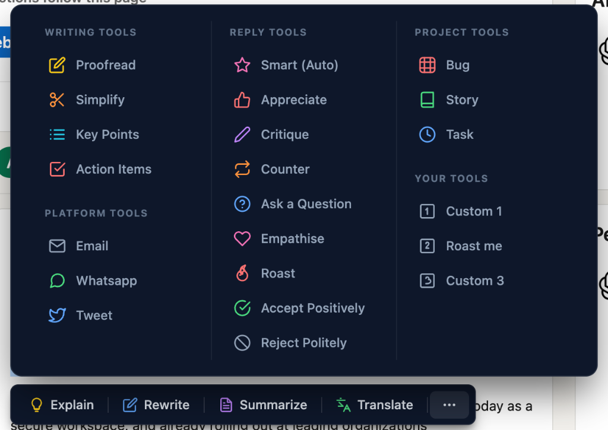

# Draftly - AI Writing Companion

**Draftly** is your all-in-one AI writing assistant for Chrome. Select any text on the web to Rewrite, Summarize, Translate, or generate professional content instantly using Google's Gemini API.

## ✨ Features

### ⚡ Core Actions
-   **🖊️ Rewrite**: Fix grammar, improve flow, and enhance tone.
-   **📝 Summarize**: concise summaries of long articles.
-   **文 Translate**: Smart translation (English <-> Hindi/Global languages).
-   **💡 Explain**: Simple layman's explanations for complex terms.

### 🛠️ Writing Tools
-   **✅ Proofread**: Fix grammar and spelling without changing tone.
-   **🔑 Key Points**: Extract bullet points from dense text.
-   **📋 Action Items**: Identify actionable tasks and to-dos.

### 💬 Social & Platform
-   **📧 Email**: Draft professional email responses with context.
-   **📱 WhatsApp**: Convert text into casual, natural messages.
-   **🐦 Tweet**: Generate compelling, short-form posts (280 chars).

### 🚀 Project Management (Jira/Agile)
-   **🐞 Bug Report**: Auto-format Selection into a structured Jira Bug.
-   **📖 User Story**: Generate standard User Stories with Acceptance Criteria.
-   **⚙️ Task**: Create technical task descriptions instantly.

### 🌟 Power User Features
-   **✨ Custom Tool**: Define your own AI prompt in Settings (e.g., "Translate to Spanish & add emoji").
-   **📋 One-Click Copy**: Instantly copy results to clipboard.
-   **🔒 Secure (BYOK)**: Bring Your Own Key. Your API key is stored locally; no data touches our servers.

## Installation

### Manual Installation (Developer Mode)
1.  Clone this repository or download the ZIP.
2.  Open Chrome and go to `chrome://extensions`.
3.  Enable **Developer mode** (top right).
4.  Click **Load unpacked** and select the project folder.
5.  Right-click the extension icon -> **Options** -> Enter your Gemini API Key.

## Tech Stack
-   **Frontend**: Vanilla JavaScript, HTML5, CSS3 (Modern Glassmorphism/Dark UI).
-   **Backend**: Chrome Extension V3 Manifest, Google Gemini API.

## Privacy
This extension processes text only when you explicitly click a button. Data is sent directly to the Google Gemini API for processing. Your API key is stored locally in your browser (`chrome.storage.sync`) and is never shared.

## Screenshots

